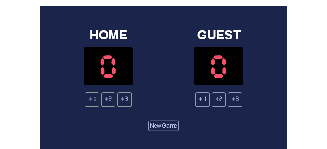

# BASKETBALL SCOREBOARD

> A basketball Scoreboard webpage built using DOM(Document Object Model).



## Built With

- HTML5 elements
  - Document Object Model(DOM) such as `getElementById`, `addEventListener`.
- JavaScript Properties
  - `function()`
- Linters
  - [Prettier](https://prettier.io/),
  - [Stylelint](https://stylelint.io/).
- GitHub Action

## Live Demo

[Live Demo Link](https://doc-basketball-scoreboard.netlify.app/)

### Development (Running locally)

- Clone the project

```bash
git clone https://github.com/moshoodabdullahi/basketball-scoreboard.git

```

- Install Dependencies

```bash
npm run install
```

To run StyleLint by itself, you may run the lint task:

```bash
npm run lint:check
```

Or to automatically fix issues found (where possible):

```bash
npm run lint
```

You can also check against Prettier:

```bash
npm run format:check
```

and to have it actually fix (to the best of its ability) any format issues, run:

```bash
npm run format
```

You can also check against HTML Validator:

```bash
npm run html-validator
```

## Style Guides

- [CSS Style Guide](http://udacity.github.io/frontend-nanodegree-styleguide/css.html)
- [HTML Style Guide](http://udacity.github.io/frontend-nanodegree-styleguide/index.html)
- [JavaScript Style Guide](http://udacity.github.io/frontend-nanodegree-styleguide/javascript.html)
- [Git Style Guide](https://udacity.github.io/git-styleguide/)

## 👤 Author

- Github: [@moshoodabdullahi](https://github.com/moshoodabdullahi)
- Linkedin: [@moshoodabdullahi](https://www.linkedin.com/in/moshoodabdullahi/)

## 🤝 Contributing

Contributions, issues and feature requests are welcome!

Feel free to check the [issues page](../../issues).

## Show your support

Give a ⭐️ if you like this project!

- Acknowledgment
  [Scrimba-Project Figma Design](<https://www.figma.com/file/R1E5jMRwQ4BluOYxPHz37O/Basketball-Scoreboard-(Copy)?type=design&node-id=0-1&t=DTQYqPeO2W2aZy0p-0>)

## 📝 License

[MIT licensed](./LICENSE).
